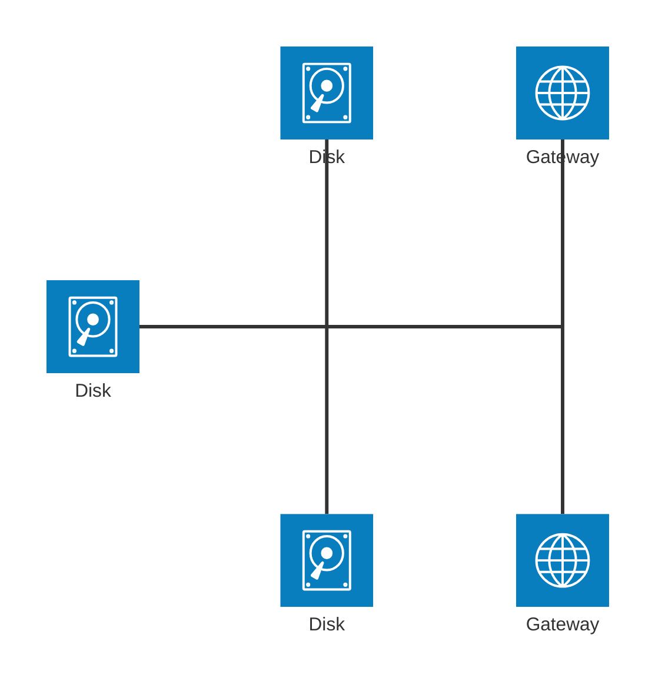

# Architecture Diagrams Documentation (v11.1.0+)

> In the context of mermaid-js, the architecture diagram is used to show the relationship between services and resources commonly found within the Cloud or CI/CD deployments. In an architecture diagram, services (nodes) are connected by edges. Related services can be placed within groups to better illustrate how they are organized.

## Example


## Syntax

The building blocks of an architecture are `groups`, `services`, `edges`, and `junctions`.

For supporting components, icons are declared by surrounding the icon name with `()`, while labels are declared by surrounding the text with `[]`.

To begin an architecture diagram, use the keyword `architecture-beta`, followed by your groups, services, edges, and junctions. While each of the 3 building blocks can be declared in any order, care must be taken to ensure the identifier was previously declared by another component.

### Groups

The syntax for declaring a group is:

```
group {group id}({icon name})[{title}] (in {parent id})?
```

Put together:

```
group public_api(cloud)[Public API]
```

creates a group identified as `public_api`, uses the icon `cloud`, and has the label `Public API`.

Additionally, groups can be placed within a group using the optional `in` keyword

```
group private_api(cloud)[Private API] in public_api
```

### Services

The syntax for declaring a service is:

```
service {service id}({icon name})[{title}] (in {parent id})?
```

Put together:

```
service database1(database)[My Database]
```

creates the service identified as `database1`, using the icon `database`, with the label `My Database`.

If the service belongs to a group, it can be placed inside it through the optional `in` keyword

```
service database1(database)[My Database] in private_api
```

### Edges

The syntax for declaring an edge is:

```
{serviceId}{{group}}?:{T|B|L|R} {<}?--{>}? {T|B|L|R}:{serviceId}{{group}}?
```

#### Edge Direction

The side of the service the edge comes out of is specified by adding a colon (`:`) to the side of the service connecting to the arrow and adding `L|R|T|B`

For example:

```
db:R -- L:server
```

creates an edge between the services `db` and `server`, with the edge coming out of the right of `db` and the left of `server`.

```
db:T -- L:server
```

creates a 90 degree edge between the services `db` and `server`, with the edge coming out of the top of `db` and the left of `server`.

#### Arrows

Arrows can be added to each side of an edge by adding `<` before the direction on the left, and/or `>` after the direction on the right.

For example:

```
subnet:R --> L:gateway
```

creates an edge with the arrow going into the `gateway` service

#### Edges out of Groups

To have an edge go from a group to another group or service within another group, the `{group}` modifier can be added after the `serviceId`.

For example:

```
service server[Server] in groupOne
service subnet[Subnet] in groupTwo

server{group}:B --> T:subnet{group}
```

creates an edge going out of `groupOne`, adjacent to `server`, and into `groupTwo`, adjacent to `subnet`.

It's important to note that `groupId`s cannot be used for specifying edges and the `{group}` modifier can only be used for services within a group.

### Aligning siblings (v11.16.0+)

When several services share similar edge topology (for example, three databases all connecting `R --> L:mcp`), the layout heuristic may collapse them onto the same coordinate so that two render on top of each other. The `align` directive declares that a set of services share a row (same y) or a column (same x), and forces them to spread along that axis.

```
align row {idA} {idB} {idC} ...
align column {idA} {idB} ...
```

Members must already be declared as services or junctions, and at least two members are required. Each `align` directive lives on its own line.

Pick the axis based on how the listed members are connected:

- Use **`align column`** when the members connect to a common downstream node _via the same horizontal port pair_ (e.g. all use `R --> L:mcp`). They naturally form a vertical stack to one side, with parallel arrows reaching the downstream node.
- Use **`align row`** when the members connect to a common downstream node _via the same vertical port pair_ (e.g. all use `B --> T:proc`). They naturally form a horizontal row above the downstream node.

Three databases all feeding `mcp` via right-to-left edges → stack them in a column:


Three sources all feeding `proc` via top-to-bottom edges → arrange them in a row:


The order of members in the `align` directive determines their order along the axis. The gap between aligned members is controlled by `idealEdgeLengthMultiplier`.

> **Note:** the declared order must not contradict the directions of edges between the listed members. For example, if the diagram contains `a:L --> R:b` (which places `a` to the right of `b`), then `align row a b` will conflict with that edge direction and the layout engine will fail to render. Use `align row b a` instead, or remove the conflicting edge.

#### Grid layouts (combining `row` and `column`)

`align row` only pins the y-coordinate of its members. To produce a clean grid where columns also align across tiers, pair each `align row` with one or more `align column` directives. The columns can span as many rows as you like — chain every node that should share an x-coordinate, even across groups.


The result is three left-to-right tiers stacked vertically with a straight spine through the middle column. Edges between aligned nodes render as straight horizontal or vertical lines; cross-axis edges (e.g. `db_one:R --> T:hub`) get a single 90° elbow.

> **Tip:** if a long single-word label is too wide to fit on one line at small `iconSize` values, increase `iconSize` (or use a shorter title) to keep it on one line.

### Junctions

Junctions are a special type of node which acts as a potential 4-way split between edges.

The syntax for declaring a junction is:

```
junction {junction id} (in {parent id})?
```



## Configuration

### `randomize` (v11.14.0+)

By default, architecture diagrams start nodes at deterministic seed positions (`randomize: false`). Setting `randomize` to `true` randomizes initial node positions before running the layout algorithm, which may produce varied but potentially better-spaced layouts on each render.

> Note: `randomize: false` alone is not enough to guarantee identical renders — the underlying fcose layout still calls `Math.random()` during its constraint solver. Use the `seed` option (described below) to lock the layout fully.

Via frontmatter:

```
%%{init: {"architecture": {"randomize": true}}}%%
architecture-beta
    group api(cloud)[API]
    service db(database)[Database] in api
    service server(server)[Server] in api
    db:R --> L:server
```

Via `mermaid.initialize()`:

```javascript
mermaid.initialize({
  architecture: {
    randomize: true,
  },
});
```

| Option      | Type    | Default | Description                                                            |
| ----------- | ------- | ------- | ---------------------------------------------------------------------- |
| `randomize` | boolean | `false` | Whether to randomize initial node positions before running the layout. |

### Layout tuning (v11.15.0+)

The following options pass through to the underlying [fcose](https://github.com/iVis-at-Bilkent/cytoscape.js-fcose) layout so you can adjust spacing and density without changing your diagram source:

| Option                      | Type   | Default | Description                                                                                                                                                                                                                                      |
| --------------------------- | ------ | ------- | ------------------------------------------------------------------------------------------------------------------------------------------------------------------------------------------------------------------------------------------------ |
| `nodeSeparation`            | number | `75`    | Minimum separation, in pixels, between sibling nodes in the same group. Pass-through to fcose.                                                                                                                                                   |
| `idealEdgeLengthMultiplier` | number | `1.5`   | Multiplier applied to `iconSize` to compute the ideal length of edges between nodes within the same group. Increase for breathing room, decrease to pack tighter. Cross-group edges are not affected.                                            |
| `edgeElasticity`            | number | `0.45`  | Spring elasticity (0–1) on same-group edges. Higher pulls connected nodes closer; lower lets them spread out. Cross-group edges are not affected.                                                                                                |
| `numIter`                   | number | `2500`  | Maximum fcose iterations. Increase for higher-quality layouts on large diagrams at the cost of render time.                                                                                                                                      |
| `seed`                      | number | `1`     | Deterministic seed for fcose. Defaults to `1` so the same diagram always renders with the same layout. Set to `0` to opt out and use native (non-deterministic) `Math.random`. Any other number selects a different reproducible layout variant. |

Example — bumping `idealEdgeLengthMultiplier` stretches the spacing between connected nodes in a chain:

```
%%{init: {"architecture": {"idealEdgeLengthMultiplier": 3}}}%%
architecture-beta
    service a(server)[A]
    service b(server)[B]
    service c(server)[C]
    a:R --> L:b
    b:R --> L:c
```

> **Note:** these knobs tune fcose's force-directed layout; they do not change which nodes the layout heuristic considers adjacent. If two siblings render on top of each other because they share the same logical position in the spatial map (a known limitation tracked in [#6120](https://github.com/mermaid-js/mermaid/issues/6120)), no combination of these knobs will move them apart — see the upcoming `align row|column` directive instead.

## Icons

By default, architecture diagram supports the following icons: `cloud`, `database`, `disk`, `internet`, `server`.
Users can use any of the 200,000+ icons available in iconify.design, or add other custom icons, by [registering an icon pack](../config/icons.md).

After the icons are installed, they can be used in the architecture diagram by using the format "name:icon-name", where name is the value used when registering the icon pack.

```mermaid-example
architecture-beta
    group api(logos:aws-lambda)[API]

    service db(logos:aws-aurora)[Database] in api
    service disk1(logos:aws-glacier)[Storage] in api
    service disk2(logos:aws-s3)[Storage] in api
    service server(logos:aws-ec2)[Server] in api

    db:L -- R:server
    disk1:T -- B:server
    disk2:T -- B:db
```


