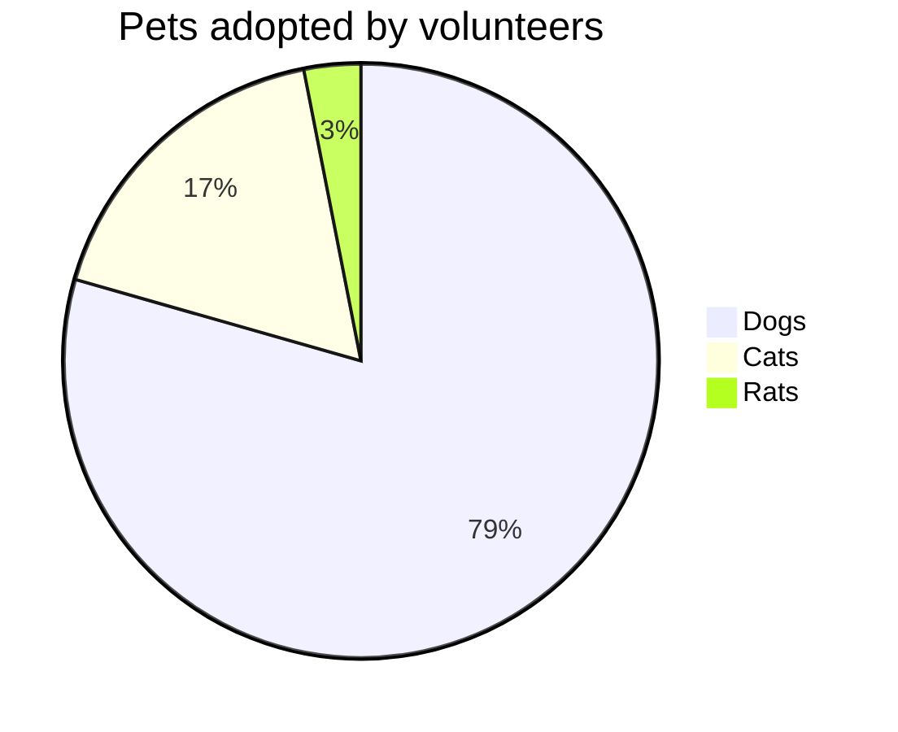
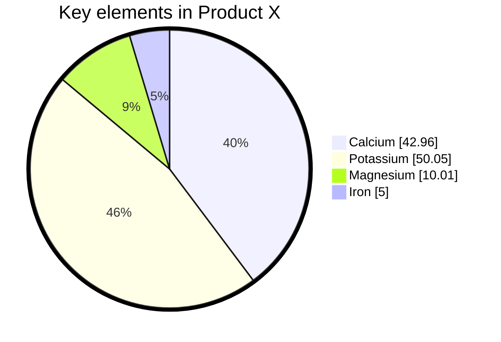

# Pie chart diagrams

> A pie chart (or a circle chart) is a circular statistical graphic, which is divided into slices to illustrate numerical proportion. In a pie chart, the arc length of each slice (and consequently its central angle and area), is proportional to the quantity it represents. While it is named for its resemblance to a pie which has been sliced, there are variations on the way it can be presented. The earliest known pie chart is generally credited to William Playfair's Statistical Breviary of 1801
> -Wikipedia

Mermaid can render Pie Chart diagrams.

## Syntax

Drawing a pie chart is really simple in mermaid.

- Start with `pie` keyword to begin the diagram
  - `showData` to render the actual data values after the legend text. This is **_OPTIONAL_**
- Followed by `title` keyword and its value in string to give a title to the pie-chart. This is **_OPTIONAL_**
- Followed by dataSet. Pie slices will be ordered clockwise in the same order as the labels.
  - `label` for a section in the pie diagram within `" "` quotes.
  - Followed by `:` colon as separator
  - Followed by `positive numeric value` (supported up to two decimal places)

**Note:**

> Pie chart values must be **positive numbers greater than zero**.
> **Negative values are not allowed** and will result in an error.

[pie] [showData] (OPTIONAL)
[title] [titlevalue] (OPTIONAL)
"[datakey1]" : [dataValue1]
"[datakey2]" : [dataValue2]
"[datakey3]" : [dataValue3]
.
.

## Donut chart diagram (v11.16.0+)

By setting `donutHole` parameter on config, Mermaid can render Donut Chart Diagram.

## Legend Position (v11.16.0+)

By setting `legendPosition` parameter on config, you can set where the legend is positioned.

## Highlight Slice (v11.16.0+)

By setting `highlightSlice` parameter on config, you can highlight specific slice. You can also highlight slice by hovering on it.

## Example

## Configuration

Possible pie diagram configuration parameters:

| Parameter        | Description                                                                                                  | Default value |
| ---------------- | ------------------------------------------------------------------------------------------------------------ | ------------- |
| `textPosition`   | The axial position of the pie slice labels, from 0.0 at the center to 1.0 at the outside edge of the circle. | `0.75`        |
| `donutHole`      | Donut hole ratio. Valid values are from `0` to `0.9`.                                                        | `0`           |
| `legendPosition` | Legend's position relative to the chart. Valid values are `top`, `bottom`, `left`, `right`, and `center`.    | `right`       |
| `highlightSlice` | Highlight specific slice with matching label. Set to 'hover' to highlight hovered slice.                     |               |
