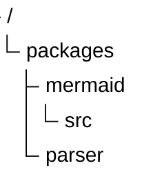
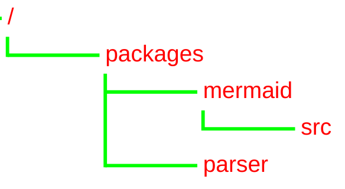

# TreeView Diagram (v11.14.0+)

## Introduction

A TreeView diagram is used to represent hierarchical data in the form of a directory-like structure, with file/folder icons, connector lines, and optional annotations.

## Syntax

The structure of the tree depends only on indentation. Labels can be **bare** (unquoted) or **quoted** (for names containing spaces).

- Directories are indicated by a trailing `/` on the label — they render in bold text.
- Icons are hidden by default — enable the built-in file/folder icons with the `showIcons` config option, or set one per node with `icon()`.
- Quoted labels (`"my file"`) support spaces in names.

```
treeView-beta
    my-project/
        src/
            index.js
        package.json
        README.md
```

Quoted labels (backward compatible):

```
treeView-beta
    "my project"
        "folder with spaces"
            "file.js"
```

## Box-Drawing Input

As an alternative to indentation, you can use box-drawing characters to define the tree structure. The parser auto-detects the format — no extra keyword or config is needed. This is how most file tree diagrams are drawn already, so you can turn those into Mermaid diagrams with very little effort.

Both standard (`├──`, `└──`, `│`) and heavy (`┣━━`, `┗━━`, `┃`) Unicode variants are supported.


All annotations work the same way — just append them after the label:


Depth is inferred from the column position of the branch character, so deeper nesting works naturally:


> **Note:** If a parse error occurs, line numbers in the error message refer to your original input. Tab characters are automatically expanded to spaces.

## Annotations

### Highlighting with :::class

Annotate a node with `:::className` to apply a CSS class. A built-in `highlight` class is provided:


### Inline descriptions with `##`

Add a visible description after `##` — rendered next to the label in italic:


### Icons

Icons are hidden by default. Set the `showIcons` config option to `true` to show the built-in icons — `file` for files and `folder` for directories:


#### File-type icons via config maps

Mermaid ships no filename/extension mapping — file-type icons are fully user-configured through the `filenameIcons` and `extensionIcons` config options, using icons from a registered [icon pack](../config/icons.md) such as [material-icon-theme](https://icon-sets.iconify.design/material-icon-theme/). Values are resolved like `icon()` references — `pack:name` is used as-is, unprefixed names resolve via `defaultIconPack`, and `none` hides the icon for matching files. Directories and unmapped files keep the built-in `folder`/`file` icons:


#### Icon overrides with icon()

Set a node's icon explicitly with `icon(name)`, where `name` is any icon from a registered [icon pack](../config/icons.md), referenced as `pack:name`. Explicit icons always render, even when `showIcons` is off:


When `defaultIconPack` is set, unprefixed names resolve in that pack — `icon(rust)` becomes shorthand for `icon(material-icon-theme:rust)`. The built-in `file` and `folder` icons can always be referenced without a prefix, e.g. `icon(folder)`.

```note
Icon packs are not bundled with Mermaid — they must be registered with `registerIconPacks` by the site embedding the diagram. See [registering icon packs](../config/icons.md). An unregistered icon renders as a question mark.
```

#### Hiding icons

When `showIcons` is enabled, use `icon()` or `icon(none)` to hide the icon of a single node:


### Combined annotations

Annotations can be combined in any order:


## Comments

Use `%%` for invisible comments (standard Mermaid convention):

```
treeView-beta
    %% Generated files — do not edit
    src/
        generated/
        index.js
```

## Examples

Basic with quoted labels:



Unicode and emoji in labels:

Labels are rendered exactly as written — unicode characters and consecutive spaces are preserved. Since the built-in icons are hidden by default, emoji make handy inline icons:


With custom config:



## Config Variables

| Property        | Description                                                                      | Default Value |
| --------------- | -------------------------------------------------------------------------------- | ------------- |
| rowIndent       | Indentation for each row                                                         | 10            |
| paddingX        | Horizontal padding of row                                                        | 5             |
| paddingY        | Vertical padding of row                                                          | 5             |
| lineThickness   | Thickness of the line                                                            | 1             |
| showIcons       | Whether to show the default file/folder icons (explicit `icon()` always renders) | false         |
| defaultIconPack | Registered iconify pack used to resolve unprefixed icon references               | ''            |
| filenameIcons   | Filename → icon map for file-type icons                                          | {}            |
| extensionIcons  | Extension → icon map for file-type icons                                         | {}            |

### Theme Variables

| Property         | Description                                               | Default Value        |
| ---------------- | --------------------------------------------------------- | -------------------- |
| labelFontSize    | Font size of the label                                    | '16px'               |
| labelColor       | Color of the label                                        | 'black'              |
| lineColor        | Color of the line                                         | 'black'              |
| iconColor        | Color of icons (applies to icons that use `currentColor`) | '#546e7a'            |
| descriptionColor | Color of `##` description text                            | '#6a9955'            |
| highlightBg      | Highlight background fill                                 | rgba(255,193,7,0.15) |
| highlightStroke  | Highlight border stroke                                   | #ffc107              |
